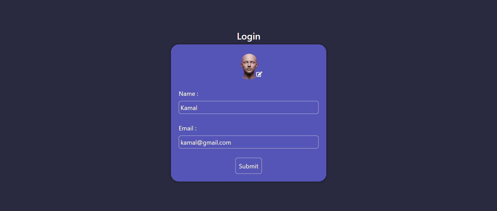
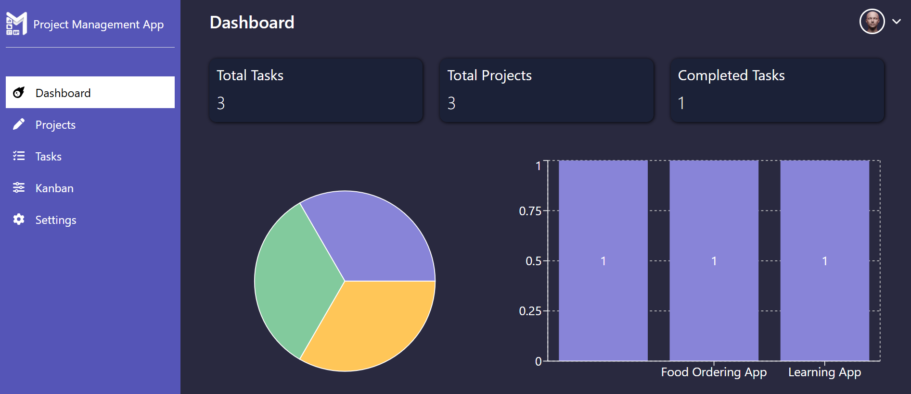
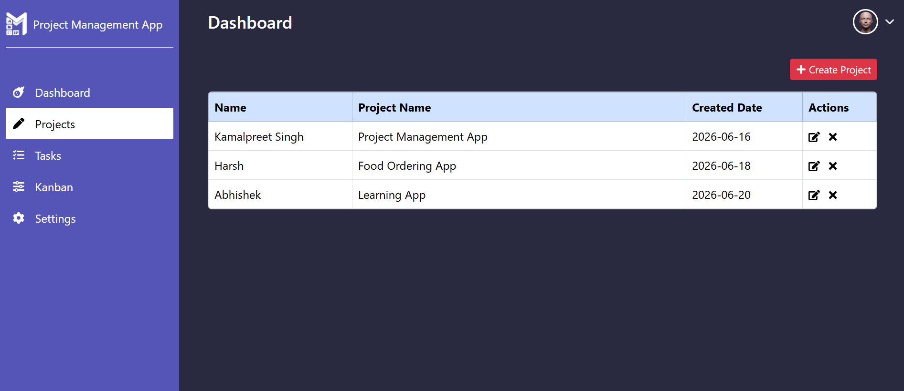
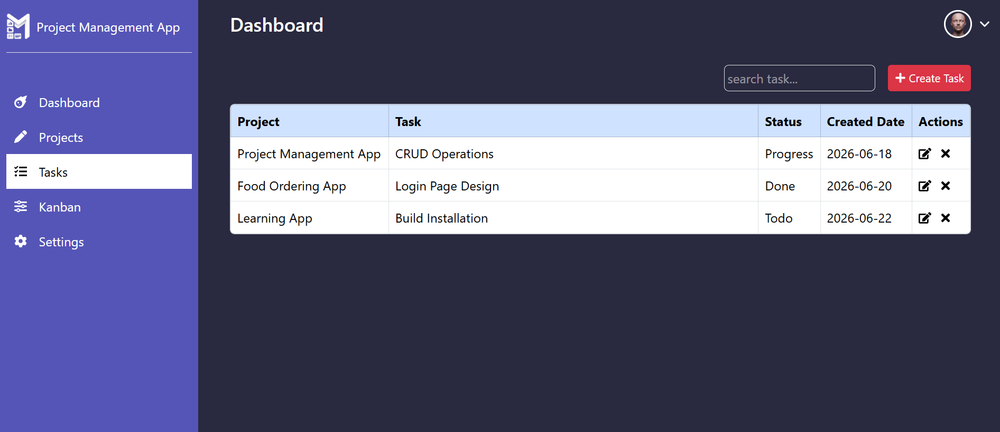
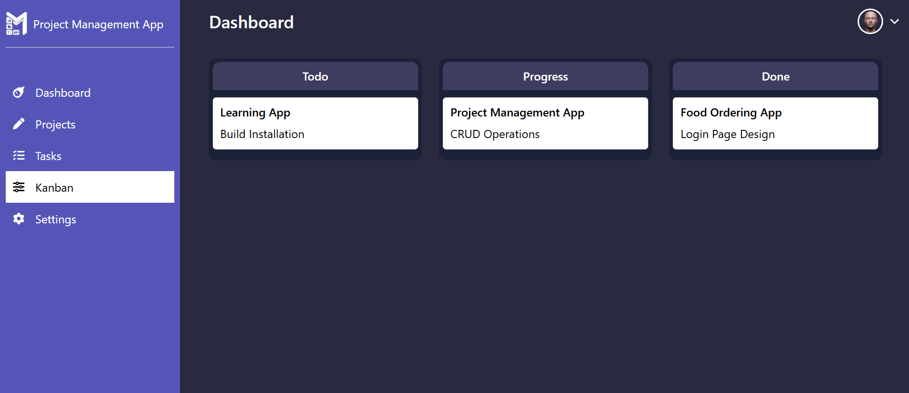
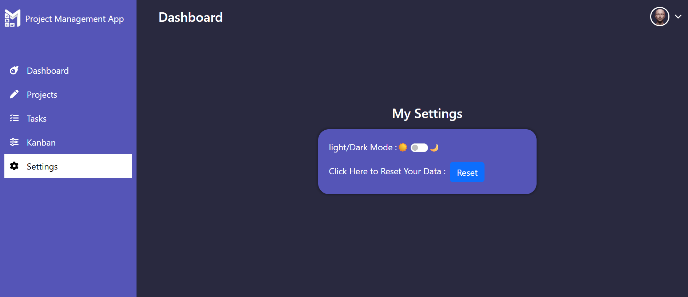
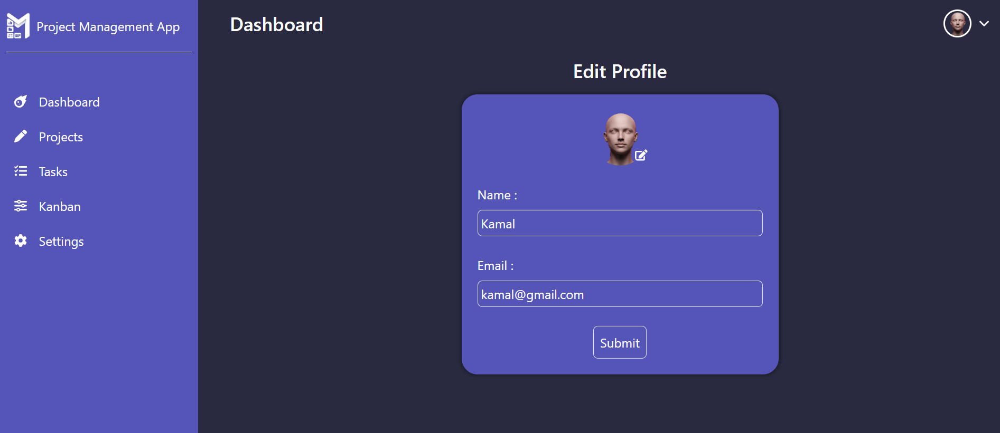

# 📊 Project Management App

A modern **Project Management App** built with **React.js** that helps users manage projects and tasks efficiently. The application includes project and task management, a Kanban board, analytics, user profile, settings, and persistent data storage using Local Storage.

---

## 🚀 Live Demo

> **Live Demo:** https://your-project-name.vercel.app

---

## 📸 Screenshots


## Login



## Dashboard



## Projects



## Tasks



## Kanban



## Settings



## Profile




---

## ✨ Features

### 📊 Dashboard
- Display total projects
- Display total tasks
- Display completed tasks
- Pie Chart (Tasks by Status)
- Bar Chart (Project Analytics)

### 📁 Project Management
- Create Project
- Edit Project
- Delete Project

### ✅ Task Management
- Create Task
- Edit Task
- Delete Task
- Assign Task to Project
- Update Task Status

### 📋 Kanban Board
- Display tasks by status
- Todo Column
- In Progress Column
- Done Column
- Drag & Drop support

### 👤 Profile
- Update profile photo
- Update user name
- Update email
- Store profile information in Local Storage

### ⚙️ Settings
- Light/Dark Theme
- Reset Application Data

### 💾 Data Persistence
- Local Storage support
- Projects persist after refresh
- Tasks persist after refresh
- User profile persists after refresh
- Theme preference persists after refresh

### 📱 Responsive Design
- Desktop
- Tablet
- Mobile

---

## 🛠️ Tech Stack

- React.js
- Vite
- React Router DOM
- Context API
- Bootstrap 5
- Recharts
- React Icons
- CSS3
- Local Storage

---

## 📂 Folder Structure

```text

project-management-app/
│
├── public/
├── screenshots/
├── src/
│   ├── assets/
│   ├── components/
│   │   ├── context/
│   │   ├── dashboard/
│   │   ├── kanban/
│   │   ├── layout/
│   │   ├── login/
│   │   ├── myProfile/
│   │   ├── projects/
│   │   ├── settings/
│   │   └── tasks/
│   ├── pages/
│   ├── App.jsx
│   └── main.jsx
│
├── package.json
├── README.md
└── vite.config.js


```

---

## ⚙️ Installation

Clone the repository

```bash
git clone https://github.com/komalpreetdev/project-management-app.git
```

Go to project folder

```bash
cd project-management-app
```

Install dependencies

```bash
npm install
```

Run the application

```bash
npm run dev
```

---

## 💡 Future Improvements

- Redux Toolkit
- Backend Integration
- Notifications
- Due Dates
- Search & Filters
- Team Collaboration
- API Integration

---

## 🎯 What I Learned

This project helped me strengthen my understanding of:

- React Components
- React Hooks
- Context API
- React Router
- CRUD Operations
- State Management
- Local Storage
- Kanban Board Implementation
- Data Visualization using Recharts
- Responsive Design
- Component Reusability

---

## 👨‍💻 Author

**Komalpreet Singh**

- GitHub:
https://github.com/komalpreetdev

- LinkedIn:
https://www.linkedin.com/in/komalpreet-singh-5402a8169/

---

## 📄 License

This project is licensed under the MIT License.
